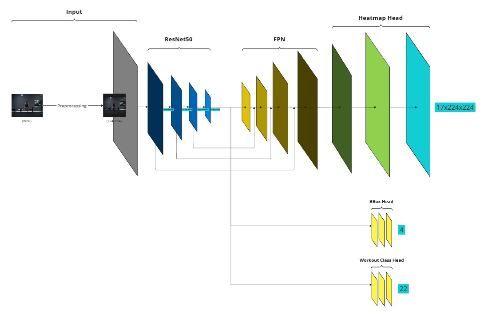

# Human Pose Estimation with Application in Workout Tracking
Capstone project of the UPC Artificial Intelligence with Deep Learning Postgraduate Course 2024-2025.

**Authors:**
- Alba Sala
- Andres Emch Boada
- Cristian Liébana Simeon
- Lionel Seoane Rollan

**Advisor:** Jorge Pueyo Morillo

## Overview
### Motivation
The fitness industry is undergoing an unprecedented transformation, driven by the rise of online training platforms and the proliferation of smart wearable devices. However, many users still rely on manual methods to track their performance, which can be inaccurate, time-consuming, and prone to errors. As the demand for virtual and home workouts continues to grow, there is a pressing need for innovative solutions that can automate this process without disrupting the user experience. 

By combining deep learning and computer vision, this project aims to develop an automated system that accurately counts exercises and monitors performance in real-time, providing users with an efficient, hands-free way to track their progress and enhance their workouts.

### Objetive
The objective of this project is to develop a deep learning model capable of real-time exercise counting and pose estimation, with the ability to differentiate between exercise types and track repetitions or duration, depending on the exercise. 
**Key Features:**
- Workout Classification: Real-time recognition of exercises (e.g., push-ups, pull-ups).
- Pose Estimation: Accurate tracking of key body part poses to ensure proper form and posture analysis.
- Exercise Counter: Automatically count repetitions or track exercise duration based on the type of exercise (e.g., counting push-ups, tracking time for planks)

## Folder Structure
```plaintext
AIDL-2025-PROJECT/
|
|
├── demo/                # Jupyter notebooks for exploratory analysis
|
|
├── notebooks/           # Jupyter notebooks for exploratory analysis
|
|
├── scripts/                               # Standalone scripts for specific tasks
│   ├── generate_keypoints_confidence.py   # Script to generate the pseudo groundtruth
│   ├── real_time_app.py                   # Script for inference using a webcam
│   ├── run_training.py                    # Script to run training
│   └── run_inference.py                   # Script for inference using an image
|
|
├── src/                 # Source code for the project
│   ├── __init__.py      # Makes src a package
│   ├── data/            # Scripts for data loading and preprocessing
│   │   ├── __init__.py
│   │   ├── dataloader.py
│   │   ├──  dataset.py
│   │   └── load_workout_data.py
│   │   
│   ├── models/          # Model architectures and utilities
│   │   ├── __init__.py
│   │   ├── baseline.py             # Baseline with heads (FC)
│   │   ├── baseline_heatmap.py     # Baseline predicting heatmaps for Keypoints
│   │   └── heatmap_fpn.py          # Heatmaps for Keypoints + FPN
│   │   
│   ├── training/        # Training scripts
│   │   ├── __init__.py
│   │   ├── train.py
│   │   └── evaluate.py
│   │   
│   └── utils/           # Helper functions and utilities
│       ├── __init__.py
│       ├── heatmaps.py
│       ├── metrics.py
│       └── visualization.py
|
|
├── workout_dataset/
│   ├── new_images/      # Images
│   └── net_labels/      # Annotations: Keypoints & BBox
|
|
├── requirements.txt     # Python dependencies
├── README.md            # Overview of the project
├── .gitignore           # Files and directories to ignore in git
└── LICENSE              # Licensing information
```

## Dataset

## Model
##### **baseline**
During the project, We trained several models to improve keypoint regression. The **baseline** model used ResNet-50 followed by a fully connected (FC) layer for direct keypoint regression. However, this approach yielded poor results, struggling to capture spatial information effectively.


To improve performance, We introduced the **baseline_heatmap** model, which added a few deconvolution layers after the last ResNet layer and adopted a heatmap-based approach. This significantly improved the results, though accurately detecting all keypoints remained challenging.


Further refinement came with the **heatmap_fpn** model, which incorporated a Feature Pyramid Network (FPN) to enhance multi-scale feature extraction. This approach further improved keypoint detection, though there was still room for refinement to achieve full accuracy.


## Results

## Conclusions

## Demo

## Biblography