# Human Pose Estimation with Application in Workout Tracking
Capstone project of the UPC Artificial Intelligence with Deep Learning Postgraduate Course 2024-2025.

**Authors:**
- Alba Sala
- Andres Emch Boada
- Cristian Liébana Simeon
- Lionel Seoane Rollan

**Advisor:** Jorge Pueyo Morillo

## Overview
### Motivation
The fitness industry is undergoing an unprecedented transformation, driven by the rise of online training platforms and the proliferation of smart wearable devices. However, many users still rely on manual methods to track their performance, which can be inaccurate, time-consuming, and prone to errors. As the demand for virtual and home workouts continues to grow, there is a pressing need for innovative solutions that can automate this process without disrupting the user experience. 

By combining deep learning and computer vision, this project aims to develop an automated system that accurately counts exercises and monitors performance in real-time, providing users with an efficient, hands-free way to track their progress and enhance their workouts.

### Objective
The objective of this project is to develop a deep learning model capable of real-time exercise counting and pose estimation, with the ability to differentiate between exercise types and track repetitions or duration, depending on the exercise. 
**Key Features:**
- Workout Classification: Real-time recognition of exercises (e.g., push-ups, pull-ups).
- Pose Estimation: Accurate tracking of key body part poses to ensure proper form and posture analysis.
- Exercise Counter: Automatically count repetitions or track exercise duration based on the type of exercise (e.g., counting push-ups, tracking time for planks)

## Folder Structure
```plaintext
AIDL-2025-PROJECT/
|
|
├── demo/                                  # Folder for demo files
|
├── logs/                                  # TensorBoard logs of different trainings
|
├── notebooks/                             # Jupyter notebooks for exploratory analysis
|
├── resources/                             # README file resources folder 
|
├── scripts/                               # Standalone scripts for specific tasks
│   ├── generate_keypoints_confidence.py   # Script to generate the pseudo groundtruth
│   ├── real_time_app.py                   # Script for inference using a webcam
│   ├── run_training.py                    # Script to run training
│   └── run_inference.py                   # Script for inference using an image
|
|
├── src/                                   # Source code for the project
│   ├── __init__.py     
│   ├── data/                              # Scripts for data loading and preprocessing
│   │   ├── __init__.py
│   │   ├── dataloader.py
│   │   ├── dataset.py
│   │   └── load_workout_data.py   
│   │   
│   ├── models/                            # Model architectures and utilities
│   │   ├── __init__.py
│   │   ├── baseline.py                    # Baseline with FC heads
│   │   ├── baseline_heatmap.py            # Baseline predicting heatmaps for Keypoints
│   │   ├── heatmap_fpn.py                 # Heatmaps for Keypoints + FPN 
│   │   ├── heatmap_fpn_v2.py              # Heatmaps for Keypoints & BBox + FPN + ConvTranspose Block
│   │   └── heatmap_fpn_v3.py              # Heatmaps for Keypoints & BBox + FPN + Upsample+Conv Block
│   │   
│   ├── training/                          # Training and evalute scripts
│   │   ├── __init__.py
│   │   ├── train.py
│   │   └── evaluate.py
│   │   
│   └── utils/                             # Helper functions and utilities
│       ├── __init__.py
│       ├── heatmaps.py
│       ├── metrics.py
│       └── visualization.py
|
|
├── workout_dataset/
│   ├── new_images/                        # Images
│   └── new_labels/                        # Annotations
|
|
├── requirements.txt                       # Python dependencies
├── README.md                              # Overview of the project
├── .gitignore                             # Files and directories to ignore in git
└── LICENSE                                # Licensing information
```

## Project Configuration
### Training
In order to train or run an inference of the model you will need to follow the next steps:
1. Clone the repo to your local or cloud machine
2. Download the dataset and extract it in the folder workout_dataset from the following link: [MEGA](https://mega.nz/folder/cIJEFITB#LCAwIp3KXHMGSwKg847oPw).
    - The path structure should be `workout_dataset/new_images` and `workout_dataset/new_labels`
3. Install the venv or conda enviroment and install the libraries
    - `pip install -r requirements_cu118.txt`  or
    - `pip install -r requirements_mps.txt` 
4. You should be ready to train the model or run an inference.
5. If it is necessary, add the project root to `PYTHONPATH`
    - `export PYTHONPATH={YOUR_PATH}/aidl-2025-project`
    - e.g: `export PYTHONPATH=/Users/test/Desktop/aidl-2025-project`

**Optional:**
In the `run_training.py` file you can modify some hyperparameters.

### Inference
The folder in [MEGA](https://mega.nz/folder/cIJEFITB#LCAwIp3KXHMGSwKg847oPw) also contains pretrained checkpoints of the model in the folder `pretrained` that can by used for inference. You can use the scripts `run_inference.py` for a single image or try the `real_time_app.py` using the webcam. Remember to download also the `.json` needed for the workout classfication mapping.

## Dataset
Our dataset is primarily based on the [Workout Exercises Kaggle Dataset](https://www.kaggle.com/datasets/hasyimabdillah/workoutexercises-images/data), which provides workout images along with exercise class labels. However, the original dataset lacks keypoint and bounding box annotations, which are crucial for our task.

### Examples:

**bench press** class


**squat** class

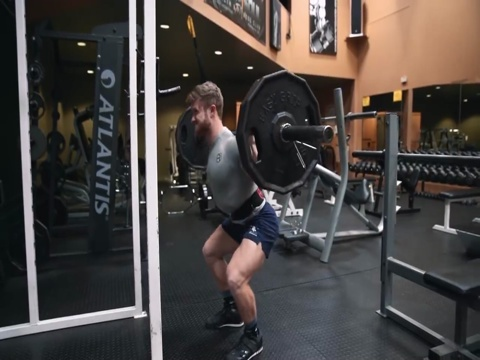

### Keypoint and Bounding Box Annotations
To generate keypoint and bounding box (bbox) labels, we used pseudo ground truth annotations predicted by the `YOLOv11x` model [[4]](#4). After multiple trials, we found it necessary to apply a data cleaning step before generating annotations. Specifically, we removed or masked additional people present in the background to focus solely on the person performing the workout. You can hide the person by using the following script: `generate_images_with_hidden_person.py`
You can reproduce the annotation generation process using the `generate_keypoints_confidence.py` script located in the `scripts` folder. This script runs the  `YOLO` model over the dataset and outputs keypoints and bounding box annotations with confidence scores.

### Dataset Augmentation
We further augmented the dataset by extracting additional workout images from YouTube videos. This was done in two steps:
1. **Video Downloading:** Using `download_video.py` to download workout videos from YouTube.
2. **Frame Extraction:** Using `video_to_image.py` to extract frames from the videos for dataset expansion.

### Dataset Cleaning
After expanding the dataset, we decided to remove two workout classes:
- `incline bench press`
- `decline bench press`

These classes were excluded due to their high similarity to the standard `bench press` exercise, which could introduce ambiguity in classification.

As a result of these modifications—pseudo-labeling, dataset augmentation, and class removal—the final dataset differs significantly from the original Kaggle version.

### Dataset Loading and Preprocessing

The dataset loading and preprocessing pipeline is implemented in the `src/data/` module, primarily across three key files: `load_workout_data.py`, `dataloader.py`, and `dataset.py`.

The process begins with `load_workout_data.py`, which loads the complete dataset, including workout images, keypoints, bounding box annotations, and workout labels. This script is responsible for reading the raw data and preparing it for further processing but does not handle any data splitting.

The dataset splitting logic is managed by `dataloader.py`. Here, the data is divided into **training** and **evaluation** sets, following an **80/20** split. The evaluation set is used during training to monitor model performance. `dataloader.py` also sets up the PyTorch `DataLoader` instances, enabling efficient batching, shuffling, and data augmentation during training and evaluation.

The core dataset handling is implemented in `dataset.py`, which defines the `WorkoutDataset` class. This class loads individual samples (images and corresponding annotations), applies data augmentation techniques (such as horizontal flipping or scaling), and performs normalization. It also generates the target outputs required by the model.

For keypoints and bounding boxes, `dataset.py` creates ground-truth heatmaps. Each keypoint is represented by a 2D Gaussian heatmap centered at its location, while bounding boxes are encoded similarly through their center points. The logic for constructing these Gaussian heatmaps resides in `utils/heatmaps.py`, which provides utility functions used by the dataset class.

This data pipeline ensures that both the input images and their corresponding labels (heatmaps for keypoints and bounding boxes, and workout class labels) are properly prepared for training and inference.

## Models
During the project, we trained several models to improve keypoint regression performance. Our approach evolved over time, starting with a **baseline** model and progressing through more sophisticated architectures aimed at better capturing spatial and multi-scale information.

The baseline model used a ResNet-50 backbone[[7]](#7) followed by a fully connected (FC) layer for direct keypoint regression. Unfortunately we haven't achieve good results with this simple head architecture.

To improve performance, we developed the **baseline_heatmap model**. This architecture added several deconvolution layers after the final ResNet-50 layer[[7]](#7) and adopted a heatmap-based regression strategy instead of direct coordinate prediction. The heatmap representation significantly improved the model’s ability to localize keypoints, although achieving consistently accurate detection across all keypoints remained challenging.
We used heatmap-based keypoint prediction inspired by previous work [[1]](#1), [[2]](#2).

Further refinement came with the **heatmap_fpn** family of models. These architectures incorporated a Feature Pyramid Network (FPN) to improved multi-scale feature extraction[[3]](#3)—essential for tasks requiring fine-grained localization at different resolutions.
We iterated through several versions of this model:

- **heatmap_fpn:** Introduced an FPN to enhance keypoint detection, but only applied the heatmap-based approach to keypoints.
- **heatmap_fpn_v2:** Extended the heatmap-based strategy to bounding box (bbox) prediction, improving object localization accuracy.
- **heatmap_fpn_v3:** Replaced `ConvTranspose` layers with `Upsample` + `Conv2d` blocks [[4]](#4), reducing model complexity and speeding up training. Additionally, v3 further reduced the model’s capacity while maintaining performance, leading to faster convergence.

### heatmap_fpn_v3 Architecture


#### Backbone and Feature Extraction:
The architecture begins with a pretrained ResNet-50 backbone[[7]](#7), using feature maps up to and including the `layer4` block. These multi-scale feature maps serve as the input for subsequent processing. The backbone parameters are frozen excepts the parameters from the `layer4` block.

#### Featured Pyramid Network (FPN)
The FPN plays a critical role in keypoint prediction by combining feature maps from different stages of the backbone. This design allows the model to leverage high-resolution features enriched with deep semantic information, which is crucial for precise localization.

####  Keypoints Head
After the FPN, the keypoint prediction head consists of two upsampling blocks:
1. **Block 1:** `Upsample` → `Conv2d` → `BatchNorm2d` → `ReLU`
2. **Block 2:** `Upsample` → `Conv2d` → `17x352x352`

These blocks progressively upsample the feature maps back to the original input resolution (352x352), enabling the model to produce dense, high-resolution heatmaps for keypoint localization.

#### Bounding Box Head
The bbox head in v3 consists of:
1. **Block 1:** `Upsample` → `Conv2d` → `BatchNorm2d` → `ReLU`
2. **Block 2:** `Upsample` → `Conv2d` → `BatchNorm2d` → `ReLU`
3. **Block 3:** `Upsample` → `Conv2d` → `BatchNorm2d` → `ReLU`
4. **Block 4:** `Upsample` → `Conv2d` → `BatchNorm2d` → `ReLU`
5. **Block 5:** `Upsample` → `Conv2d` → `BatchNorm2d` → `ReLU`
6. **Block 6** `Conv2d` → `4x352x352`

This structure upsamples the final ResNet-50 feature map back to the original input size, producing a heatmap-based bounding box prediction.

#### Workout Classification Head
The Workout Classification Head predicts the workout type from the global features of the ResNet-50 backbone. It consists of:
1. **Block 1:** `AdaptiveAvgPool2d(1)` → `Flatten`
2. **Block 2:** `Linear` → `ReLU`
3. **Block 3:** `Linear` → `num_classes`

This head enables the model to classify the workout in parallel with keypoint and bounding box predictions.

## Exercise Counter
The second part of the project focuses on using our model capable of pose estimation and use it for real-time exercise counting. To do so, the model will extract frames from a video and calculate the person's position (start, medium, end) given the exercise class prediction, and count the repetitions or seconds, out of the predicted results. 
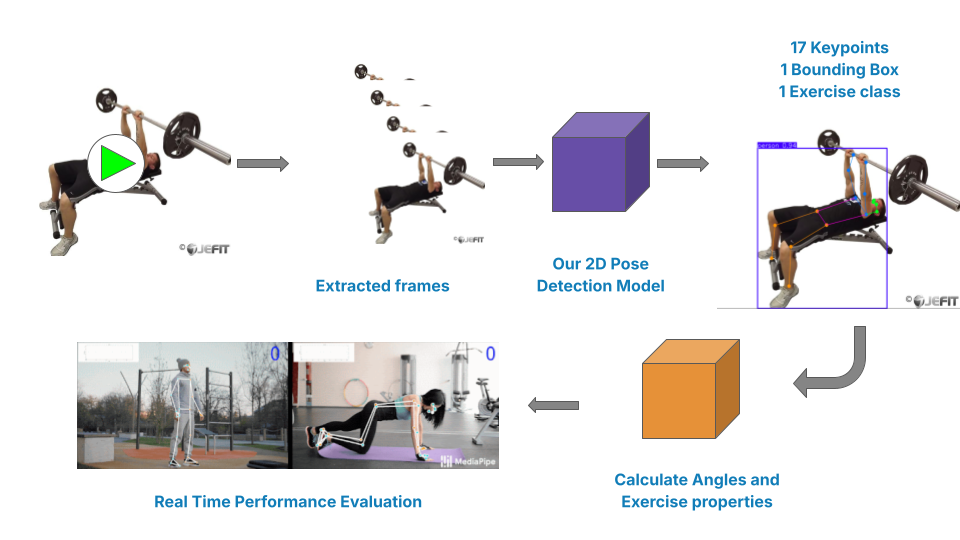
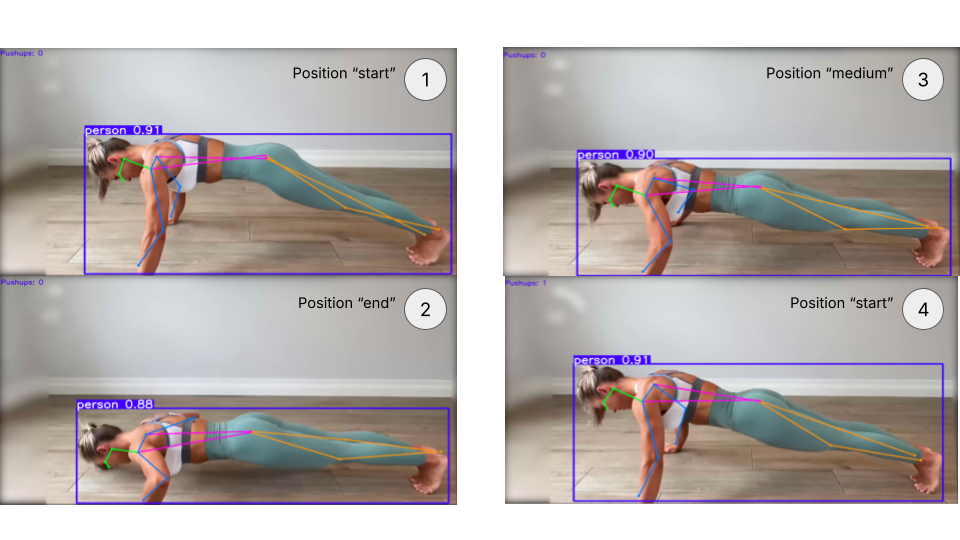

## Model Training

### Hyperparameters
- `resize_to`: Resize the input images to this size. The options are `[224x224]`, `[256x256]`, `[288x288]`, `[320x320]`, and `[352x352]`.
- `batch_size`: The number of images in each batch.
- `num_epochs`: The number of epochs for which the model will be trained.
- `lr`: Learning rate used for training the model. It's set as a list for different parts of the model. You can experiment with different values like `[1e-4, 1e-3, 2e-4, 1e-3]`.
- `loss_weights`: These weights help in balancing the losses from different tasks (bounding boxes, keypoints, and workout label classification). Default values are `[0.002, 0.95, 0.055]`.
- `autocast_enabled`: Set to True if you want to use mixed precision training.

### Losses
During training, the `heatmap_fpn_v3` model optimizes a combined loss function that addresses three key tasks: bounding box regression, keypoint heatmap regression, and workout label classification. The overall loss is a weighted sum of the individual loss components.

$$
\text{Total Loss} = \lambda_{bbox} \cdot \text{BBox Loss} + \lambda_{keypoints} \cdot \text{Keypoints Loss} + \lambda_{classification} \cdot \text{Classification Loss}
$$

Where:
- $\lambda_{bbox}$ is the weight for the bounding box loss.
- $\lambda_{keypoints}$ is the weight for the keypoints loss.
- $\lambda_{classification}$ is the weight for the classification loss.

#### Bounding Box Loss
The bounding box loss is calculated using the Mean Squared Error (MSE) between the predicted bounding box heatmaps and the ground truth bounding box heatmaps.

$$
\text{BBox Loss} = \text{MSE}(\text{Predicted BBox Heatmaps}, \text{Ground Truth BBox Heatmaps})
$$

#### Keypoints Loss
The keypoints loss is calculated using the Mean Squared Error (MSE) between the predicted keypoint heatmaps and the ground truth keypoint heatmaps, with an important addition: a confidence mask.

$$
\text{Keypoints Loss} = \frac{\sum (\text{MSE}(\text{Predicted Keypoint Heatmaps}, \text{Ground Truth Keypoint Heatmaps}) \cdot \text{Confidence Mask})}{\sum \text{Confidence Mask} + \epsilon}
$$

#### Classification Loss
The classification loss is calculated using the Cross-Entropy Loss between the predicted workout class probabilities and the ground truth workout class labels.

$$
\text{Classification Loss} = \text{CrossEntropyLoss}(\text{Predicted Class Probabilities}, \text{Ground Truth Class Labels})
$$

### Hardware

#### Experiments:
Initial experiments and model development were conducted on a local machine equipped with an `NVIDIA RTX 2070`, featuring an `Intel i7 10th generation` processor.

#### Final Training:
For the final, more extensive training runs, a cloud-based machine was utilized.
This machine was provisioned with an `NVIDIA H100 PCIe GPU`, `24vCPUs`, and `188 GB RAM`.
The transition to the H100 GPU significantly accelerated the training process, enabling the completion of more epochs and in a shorter time.

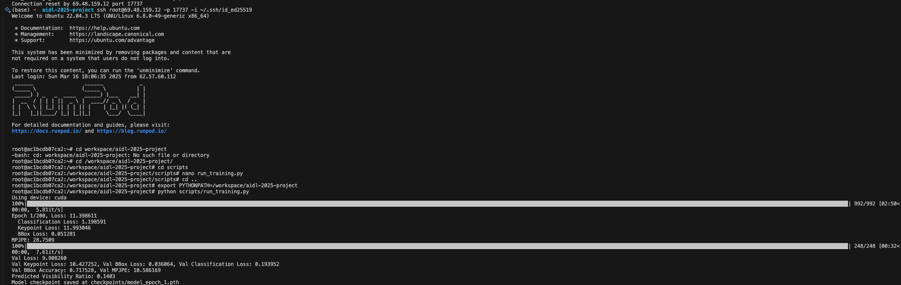

### Monitoring

#### Metrics:
During training, several metrics are monitored to track the model's performance:
- **Training Loss:** The combined loss value calculated on the training batches.
- **Validation Loss:** The combined loss value calculated on the validation batches.
- **Keypoint PCK** (Percentage of Correct Keypoints): Calculated at thresholds of `0.01`, `0.05`, and `0.1`.
- **Keypoint MPJPE** (Mean Per Joint Position Error): Average error in keypoint localization.
- **Bounding Box IoU** (Intersection over Union): Measure of overlap between predicted and ground truth bounding boxes.
- **Classification Accuracy:** Accuracy of workout classification.
- **Classification Precision and Recall:** Precision and recall per class.

#### Tools:
Validation metrics are calculated at the end of each training epoch, providing a comprehensive view of the model's performance on the validation set.

#### Validation Frequency:
The training process utilizes `TensorBoard` to visualize and track these metrics over epochs. This allows for real-time monitoring of training progress and identification of potential issues.

## Results

### Experiment 1 - Comparing Different Architectures

We conducted a controlled experiment over **15 epochs** to evaluate the improvements introduced by different model architectures. The same **dataset**, **hyperparameters**, and **data augmentation transformations** were applied across all experiments to ensure fairness and consistency.

The **only difference** between the models lies in their architectures.

Since the regression losses and heatmap-based losses for bounding boxes and keypoints **are not directly comparable** (i.e., comparing a 17x352x352 heatmap target versus 17x3 regression outputs), we focus on **accuracy-based metrics** for the comparison.

In the following table, it is demonstrated that the `fpn_v3` architecture significantly outperforms the previous models in predicting both Keypoints and Bounding Boxes (BBox).

| Model               | Keypoint MPJPE & PCK@0.01       | BBox IoU@0.8 |
|---------------------|---------------------------------|--------------|
| baseline            | 15.90  &  0.02                  | 0.36         |
| baseline_heatmap    | 11.59  &  0.29                  | 0.32         |
| fpn_v3              | 8.798  &  0.42                  | 0.85         |

#### Bounding Box Results
After 15 epochs, the IoU (Intersection over Union) score for the `fpn_v3` model exceeds **0.85**, while the baseline and baseline_heatmap models remain around **0.35**.
This significant improvement comes from replacing the fully connected (FC) head with a heatmap-based head.

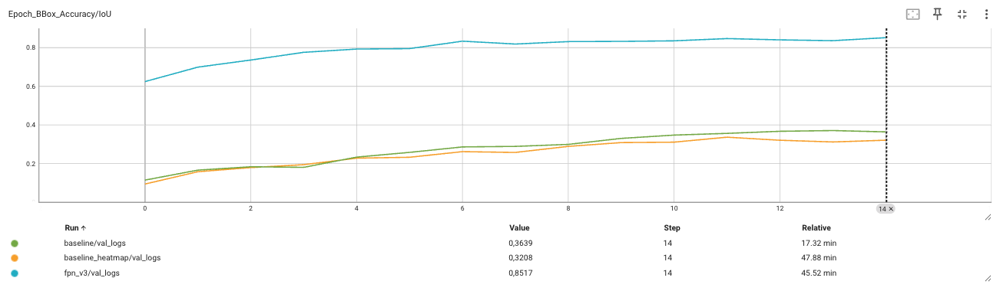

#### Workout Classification Results
The classification head remains identical across all architectures. As a result, there is no significant difference in classification metrics between models.

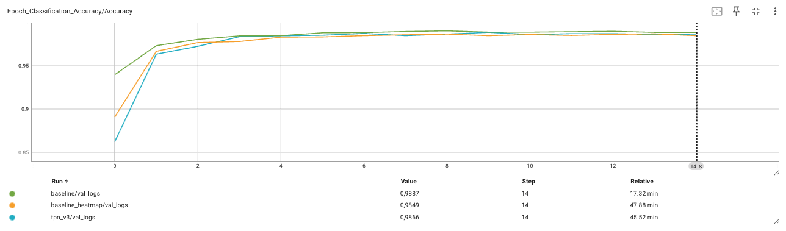
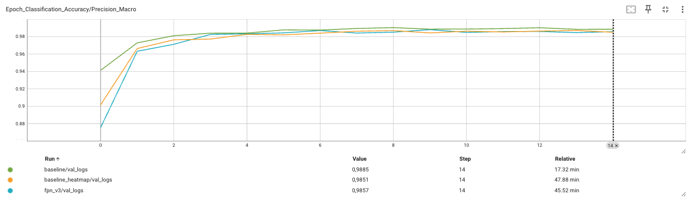
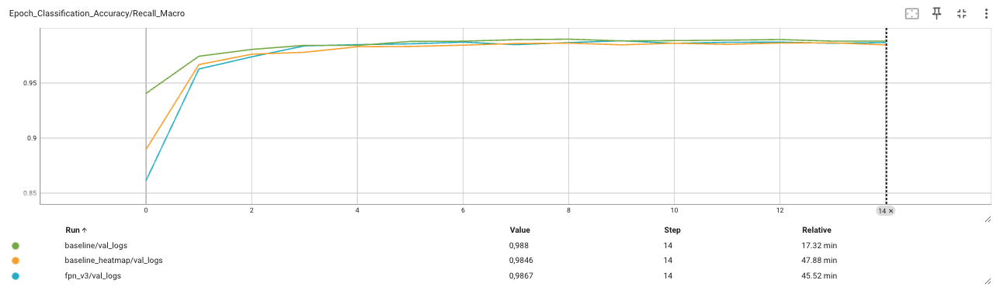

#### Keypoints Results
The **Mean Per Joint Position Error (MPJPE)** is substantially lower in the `fpn_v3` model compared to both the `baseline_heatmap` and the `baseline`. Additionally, the **PCK@0.01** (Percentage of Correct Keypoints) metric shows clear improvements for the `fpn_v3` model.

The transition from regression-based outputs to heatmap-based outputs significantly improves performance. Furthermore, integrating the Feature Pyramid Network (FPN) boosts overall accuracy in keypoint estimation.

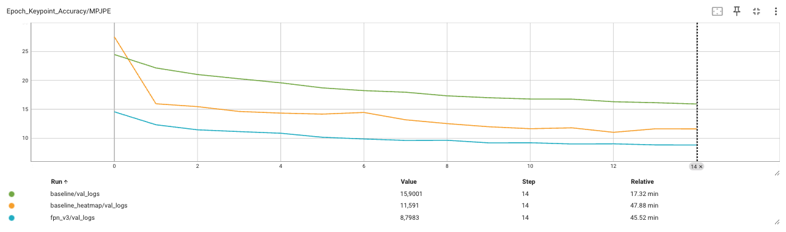
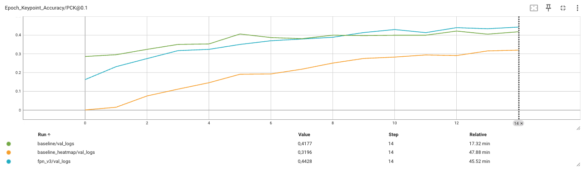
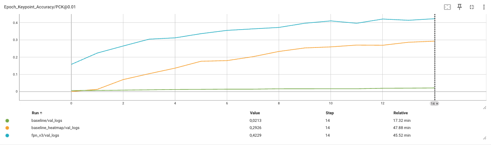

### Experiment 2 - Frozen vs Unfrozen Backbone (Fine-tuning Layer4)

The second experiment focused on unfreezing the `layer4` block of the `ResNet50` backbone, resulting in notable improvements in the model’s accuracy.

| Model               | Keypoint MPJPE & PCK@0.01       | BBox IoU@0.8 |
|---------------------|---------------------------------|--------------|
| frozen backbone     | 10.1  &  0.61                   | 0.87         |
| unfrozen backbone   | 4.60  &  0.80                   | 0.97         |

#### Bounding Box Results
We observed a substantial improvement in bounding box accuracy. The `IoU@0.8` increased from 0.87 to over 0.95 on the test set. Additionally, the head `Loss` decreased significantly, indicating better convergence and more precise predictions.

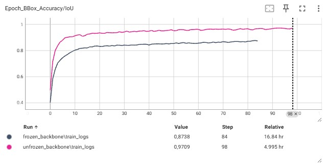
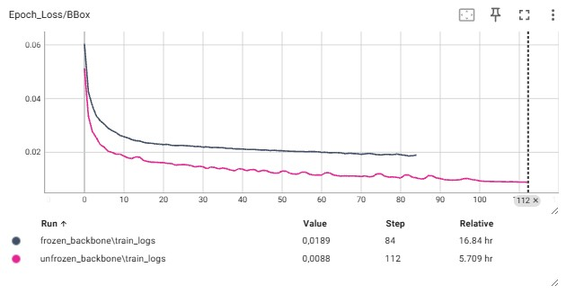

#### Keypoints Results
The keypoints head also demonstrated notable improvements. Both the `MPJPE` and the `Loss` values decreased significantly, while the `PCK@0.01 `metric increased from 0.61 to over 0.8 after 84 epochs.

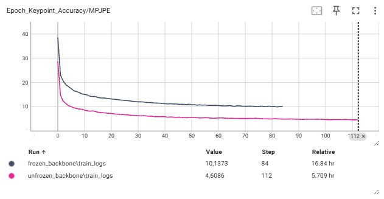
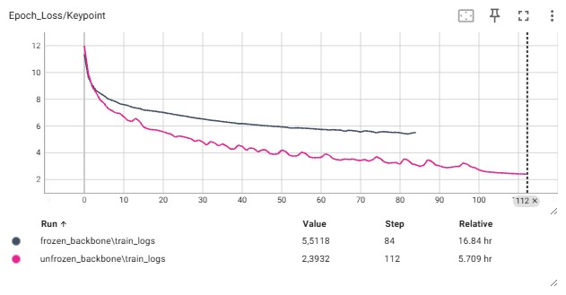
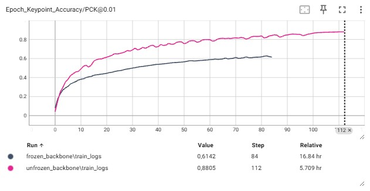

### Full Training - Best Model Performance (fpn_v3 with Unfrozen Backbone)
After conducting a series of controlled experiments to evaluate different architectures and fine-tuning strategies, the `heatmap_fpn_v3` model, with an **unfrozen** `layer4` **block** from the `ResNet50` backbone, was identified as the best-performing configuration.
This section presents a comprehensive analysis of the training process and evaluation results obtained after **130 epochs** of full training using this architecture.

#### Training and Validation Total Loss
The **total loss** curve illustrates a consistent and steady decrease throughout the training process. During the initial 20 epochs, there is a sharp decline, indicating that the model rapidly learns the fundamental features for the tasks at hand. After this early phase, the model continues to improve gradually, with the total loss approaching convergence by the later epochs.
The validation loss follows a similar trend, maintaining a stable gap relative to the training loss. This suggests that the model generalizes well to unseen data and there is no significant evidence of overfitting.

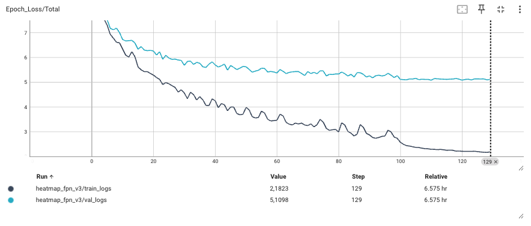

#### Bounding Box Head
The bounding box head demonstrates strong and consistent convergence throughout training. The **Bounding Box Los**s** decreases sharply within the first 20 epochs as the model quickly learns to localize objects within the images. Beyond this point, both the training and validation losses stabilize at low values. By the final epoch, the training loss reaches **0.0087**, while the validation loss settles at **0.0122**.
The minimal difference between the training and validation losses indicates robust generalization and suggests the model is not overfitting to the training data.

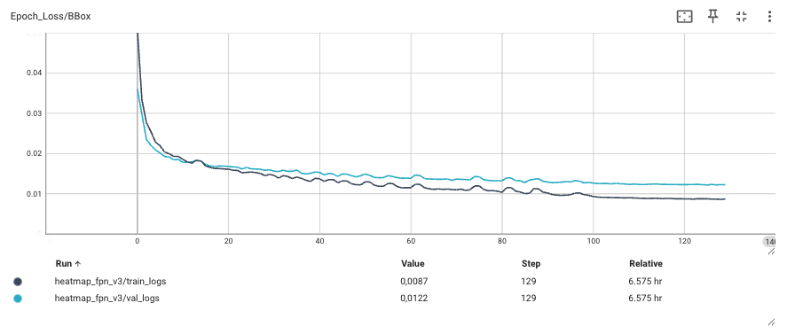

Further supporting these observations, the **Bounding Box IoU** Accuracy demonstrates a steady improvement across epochs. The **training IoU** reaches **0.975**, while the **validation IoU** stabilizes at **0.9337**. This performance reflects the model's ability to predict accurate and consistent bounding boxes across both training and validation datasets.

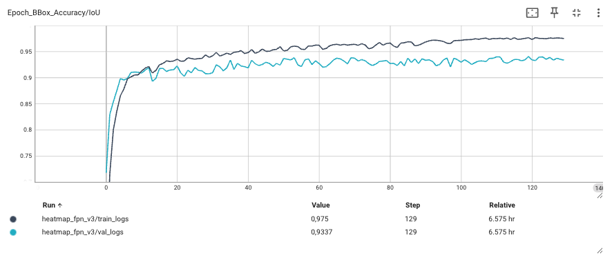

#### Keypoints Head
The keypoint detection head presents a more challenging optimization process, which is reflected in its learning curves. The **Keypoint Loss** for the training set decreases consistently over time, reaching **2.2963** by the end of training. However, the **validation loss** stabilizes at a higher value of **5.3778**, with greater fluctuation between epochs.
This disparity between the training and validation losses suggests that keypoint detection is a more complex task, potentially due to greater variation in body poses, occlusions, or the presence of difficult samples in the validation set.

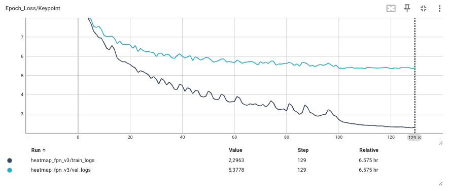

Despite these challenges, the model achieves a **Mean Per Joint Position Error (MPJPE)** of **3.5758** on the **validation set**, demonstrating its ability to accurately predict joint locations. The **PCK@0.01** metric further confirms the model's performance, with **77.31%** of keypoints predicted within 1% of the object's size. Additionally, the **Predicted Visibility Ratio**, which measures the model's ability to correctly identify whether keypoints are visible, stabilizes at **89.56%** in the **validation set**.
These results indicate that, while the keypoint head is more sensitive to data complexity, it still achieves a strong level of accuracy in joint localization and visibility prediction.

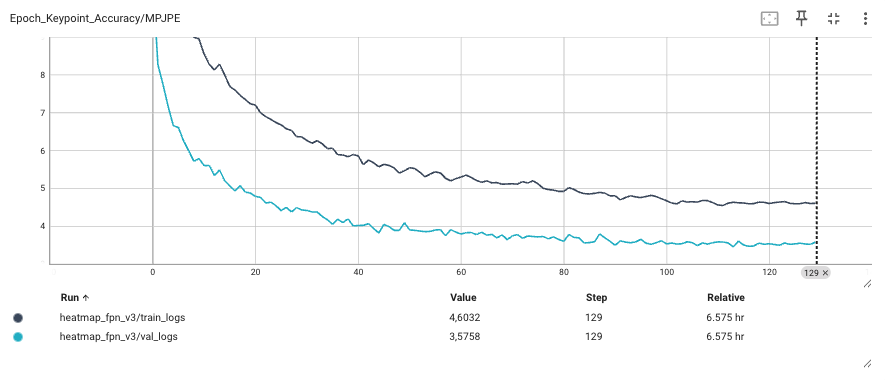
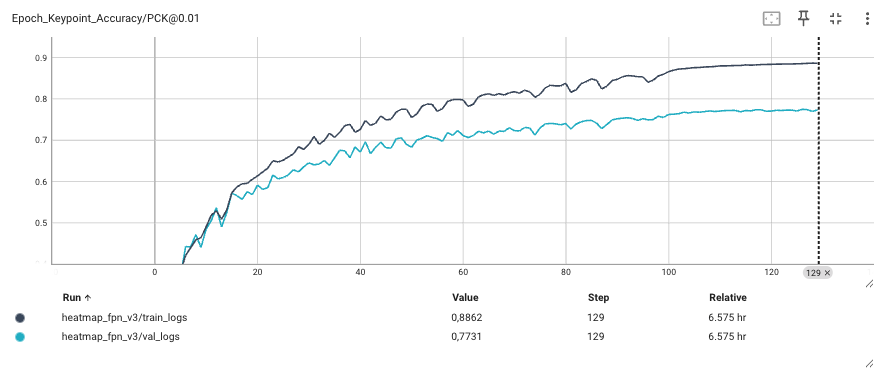
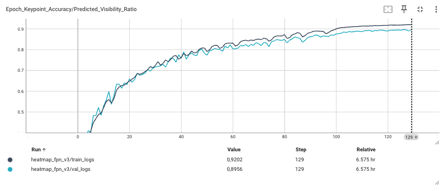

#### Classification Head
The classification head exhibits rapid and stable convergence. The **Classification Loss** decreases sharply within the first few epochs and remains low and stable throughout the remainder of the training process. By the final epoch, the **training** and **validation** losses reach **0.1535** and **0.1342**, respectively. The similarity between these values indicates that the model generalizes well across datasets, with no signs of overfitting.

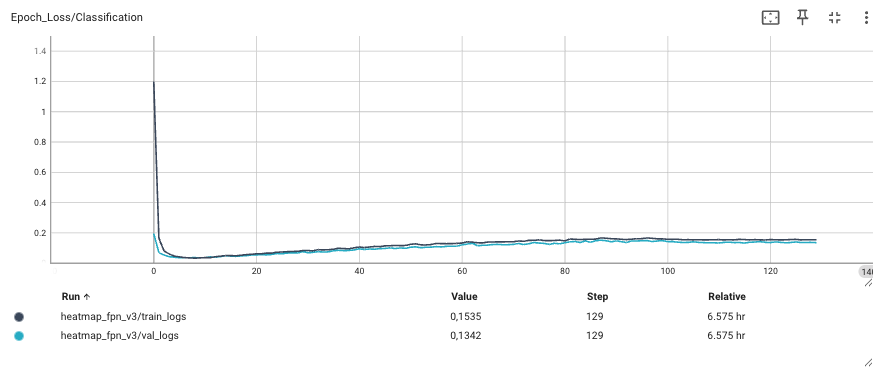

This stable convergence is further supported by the **Classification Accuracy**, which consistently remains above **98.8%** in both **training** and **validation** datasets. Similarly, both **Precision** and **Recall** scores stay consistently high, each stabilizing above **98.7%**.
These metrics confirm that the classification head is able to distinguish between different action classes with high precision and recall, ensuring reliable performance in action recognition tasks, even when evaluated on unseen data.

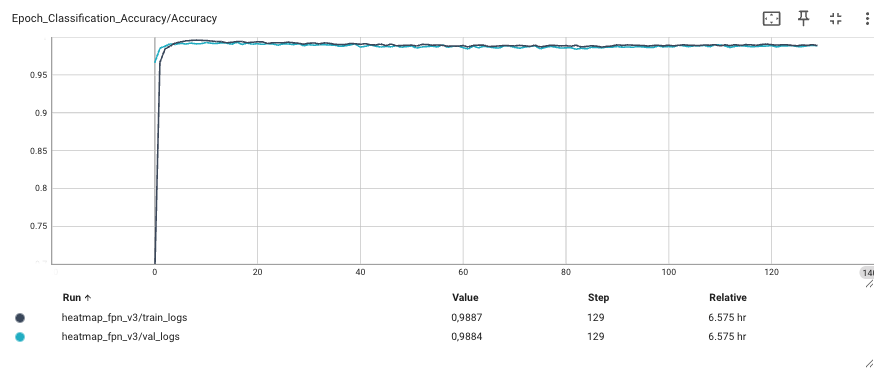
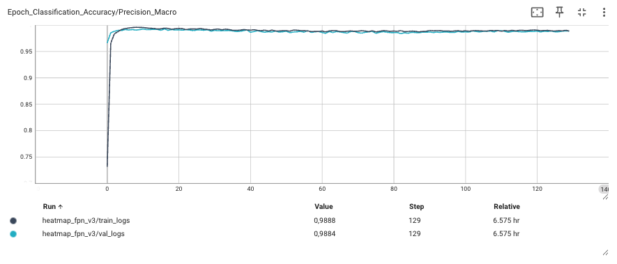
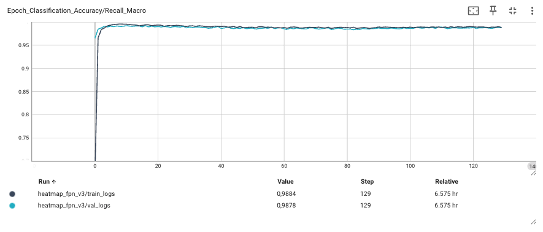

## Conclusions

### Key Achievements

#### Accurate Pose Estimation
The model successfully estimates keypoints with high accuracy, achieving a PCK@0.01 of 77.31% and an MPJPE of 3.58 on the validation set, demonstrating its effectiveness in localizing human joints.

#### Improved Architecture
Transitioning from a fully connected regression model to a heatmap-based approach with Feature Pyramid Networks (FPN) significantly enhanced both keypoint and bounding box accuracy.

#### Optimized Bounding Box Detection
The final model achieves an IoU@0.8 of 0.97, reflecting highly precise localization of individuals in workout settings.

#### Effective Workout Classification
The classification head provides reliable predictions, maintaining an accuracy of 98.8%, ensuring robust exercise recognition.

#### Real-Time Performance:
The implementation supports real-time inference, allowing users to track their workout progress effectively.

### Challenges and Limitations

#### Dataset Quality
The keypoint and bounding box labels were generated using pseudo-labels from YOLOv11x. Although this facilitated the annotation process, it introduced label noise that potentially impacted the accuracy of keypoint predictions.

#### Multiple Person Detection
Although we performed image cleaning, the model struggles with scenarios involving multiple people in a frame.

#### Repetition Counter
Currently based on simple state machine logic, which may fail in irregular movements or poorly detected keypoints.

#### Generalization
The model was primarily trained on workout exercises and may not generalize well to other types of human poses or different environments.

### Proposals for Improvements

#### Integrate Self-Attention Mechanisms (Transformers)
Recent research, such as ViTPose [[5]](#5), demonstrates that self-attention significantly improves keypoint detection accuracy by capturing long-range dependencies and global context. Incorporating transformer-based architectures or adding self-attention layers to the existing model could enhance both precision and robustness in keypoint localization.
Unfortunately, due to time constraints, we have not yet explored this architecture in our current work.

#### Introduce Automated Hyperparameter Tuning with Proper Validation Splits
In the current implementation, hyperparameters—such as learning rate, loss weights, and augmentation settings—were manually selected through trial and error, often requiring extensive post-training analysis and adjustments. There is an opportunity to streamline this process by implementing a **proper validation pipeline** and leveraging **automated hyperparameter tuning** tools (e.g., Optuna, Ray Tune). A more systematic approach to tuning would reduce manual intervention, improve reproducibility, and potentially lead to better model performance.  

#### Improved Multi-Person Handling
Future iterations should address multi-person detection and person re-identification to focus accurately on the primary subject in the frame, even in crowded environments.

## Demo

#### Real-time Inference with Webcam
You can run a real-time demo by executing:
`python scripts/real_time_app.py`

In the demo folder, we have put a video recorded at home using the real_time_app without any regularization technique.
`demo/model_inference.py`

## Bibliography

<a id="1">1.</a> Adrian Bulat and Georgios Tzimiropoulos. 2016. [Human pose estimation via convolutional part heatmap regression](https://arxiv.org/pdf/1609.01743)

<a id="2">2.</a> B. Xiao, H. Wu, and Y. Wei. [Simple baselines for human pose estimation and tracking](https://arxiv.org/pdf/1804.06208). In Proceedings of the European conference on computer vision (ECCV), 2018

<a id="3">3.</a> Wei Yang, Shuang Li, Wanli Ouyang, Hongsheng Li, and Xiaogang Wang. 2017. [Learning feature pyramids for human pose estimation](https://arxiv.org/pdf/1708.01101). In proceedings of the IEEE international conference on computer vision. 1281–1290

<a id="4">4.</a> Haoming Chen, Runyang Feng, Sifan Wu, Hao Xu, Fengcheng Zhou, Zhenguang Liu. [2D Human pose estimation: a survey](https://arxiv.org/pdf/2204.07370). Multim. Syst. 29(5): 3115-3138 (2023)

<a id="5">5.</a> Xu, Y., Zhang, J., Zhang, Q. & Tao, D. [Vitpose: Simple vision transformer baselines for human pose estimation](https://arxiv.org/pdf/2204.12484). Adv. Neural Inf. Process. Syst. 35, 38571–38584 (2022)

<a id="6">6.</a> Khanam, R.; Hussain, M. [YOLOv11: An Overview of the Key Architectural Enhancements](https://arxiv.org/pdf/2410.17725). arXiv 2024, arXiv:2410.17725

<a id="7">7.</a> Kaiming He, Xiangyu Zhang, Shaoqing Ren, and Jian Sun. [Deep Residual Learning for Image Recognition](https://arxiv.org/abs/1512.03385). *Proceedings of the IEEE Conference on Computer Vision and Pattern Recognition (CVPR)*, 2016
