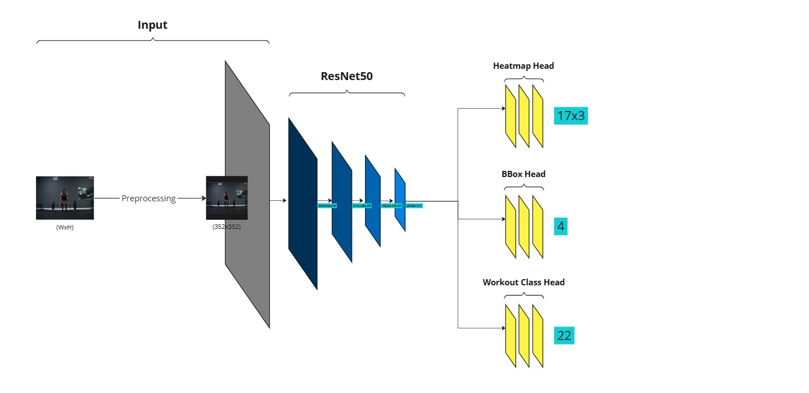
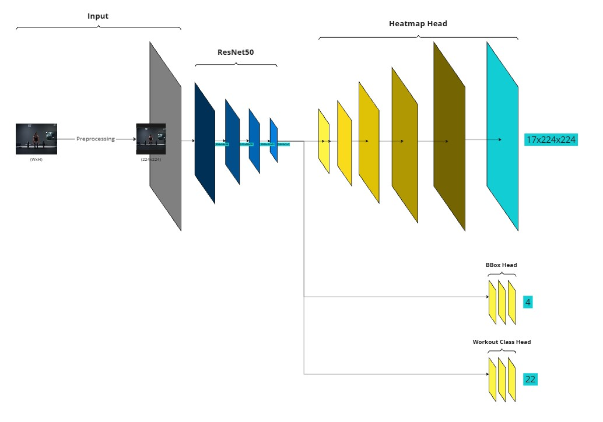
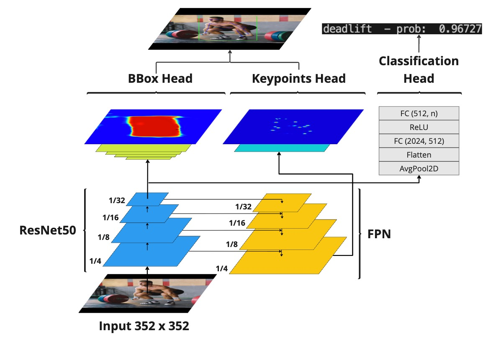

# Human Pose Estimation with Application in Workout Tracking
Capstone project of the UPC Artificial Intelligence with Deep Learning Postgraduate Course 2024-2025.

**Authors:**
- Alba Sala
- Andres Emch Boada
- Cristian Liébana Simeon
- Lionel Seoane Rollan

**Advisor:** Jorge Pueyo Morillo

## Overview
### Motivation
The fitness industry is undergoing an unprecedented transformation, driven by the rise of online training platforms and the proliferation of smart wearable devices. However, many users still rely on manual methods to track their performance, which can be inaccurate, time-consuming, and prone to errors. As the demand for virtual and home workouts continues to grow, there is a pressing need for innovative solutions that can automate this process without disrupting the user experience. 

By combining deep learning and computer vision, this project aims to develop an automated system that accurately counts exercises and monitors performance in real-time, providing users with an efficient, hands-free way to track their progress and enhance their workouts.

### Objetive
The objective of this project is to develop a deep learning model capable of real-time exercise counting and pose estimation, with the ability to differentiate between exercise types and track repetitions or duration, depending on the exercise. 
**Key Features:**
- Workout Classification: Real-time recognition of exercises (e.g., push-ups, pull-ups).
- Pose Estimation: Accurate tracking of key body part poses to ensure proper form and posture analysis.
- Exercise Counter: Automatically count repetitions or track exercise duration based on the type of exercise (e.g., counting push-ups, tracking time for planks)

## Folder Structure
```plaintext
AIDL-2025-PROJECT/
|
|
├── demo/                                  # Folder for demo files
|
├── logs/                                  # TensorBoard logs of different trainings
|
├── notebooks/                             # Jupyter notebooks for exploratory analysis
|
├── resources/                             # README file resources folder 
|
├── scripts/                               # Standalone scripts for specific tasks
│   ├── generate_keypoints_confidence.py   # Script to generate the pseudo groundtruth
│   ├── real_time_app.py                   # Script for inference using a webcam
│   ├── run_training.py                    # Script to run training
│   └── run_inference.py                   # Script for inference using an image
|
|
├── src/                                   # Source code for the project
│   ├── __init__.py     
│   ├── data/                              # Scripts for data loading and preprocessing
│   │   ├── __init__.py
│   │   ├── dataloader.py
│   │   ├── dataset.py
│   │   └── load_workout_data.py   
│   │   
│   ├── models/                            # Model architectures and utilities
│   │   ├── __init__.py
│   │   ├── baseline.py                    # Baseline with FC heads
│   │   ├── baseline_heatmap.py            # Baseline predicting heatmaps for Keypoints
│   │   ├── heatmap_fpn.py                 # Heatmaps for Keypoints + FPN 
│   │   ├── heatmap_fpn_v2.py              # Heatmaps for Keypoints & BBox + FPN + ConvTranspose Block
│   │   └── heatmap_fpn_v3.py              # Heatmaps for Keypoints & BBox + FPN + Upsample+Conv Block
│   │   
│   ├── training/                          # Training and evalute scripts
│   │   ├── __init__.py
│   │   ├── train.py
│   │   └── evaluate.py
│   │   
│   └── utils/                             # Helper functions and utilities
│       ├── __init__.py
│       ├── heatmaps.py
│       ├── metrics.py
│       └── visualization.py
|
|
├── workout_dataset/
│   ├── new_images/                        # Images
│   └── new_labels/                        # Annotations
|
|
├── requirements.txt                       # Python dependencies
├── README.md                              # Overview of the project
├── .gitignore                             # Files and directories to ignore in git
└── LICENSE                                # Licensing information
```

## Project Configuration
In order to train or run an inference of the model you will need to follow the next steps:
1. Clone the repo to your local or cloud machine
2. Download the dataset and extract it in the folder workout_dataset from the following link: [MEGA](https://mega.nz/file/cchi1C7T#6QIFmEqopbOWcxgIpwTLkXptHp70v-veDmQ7pw29FLc).
    - The path structure should be `workout_dataset/new_images` and `workout_dataset/new_labels`
3. Install the venv or conda enviroment and install the libraries
    - `pip install -r requirements.txt` 
4. You should be ready to train the model or run an inference.
5. If it is necessary, add the project root to `PYTHONPATH`
    - `export PYTHONPATH={YOUR_PATH}/aidl-2025-project`
    - e.g: `export PYTHONPATH=/Users/test/Desktop/aidl-2025-project`

**Optional:**
In the `run_training.py` file you can modify some hyperparameters.

## Dataset
Our dataset is primarily based on the [Workout Exercises Kaggle Dataset](https://www.kaggle.com/datasets/hasyimabdillah/workoutexercises-images/data), which provides workout images along with exercise class labels. However, the original dataset lacks keypoint and bounding box annotations, which are crucial for our task.
#### Keypoint and Bounding Box Annotations
To generate keypoint and bounding box labels, we used pseudo ground truth annotations predicted by the `YOLOv11x` model [[4]](#4). After multiple trials, we found it necessary to apply a data cleaning step before generating annotations. Specifically, we removed or masked additional people present in the background to focus solely on the person performing the workout. `(MISSING SCRIPT)`
You can reproduce the annotation generation process using the `generate_keypoints_confidence.py` script located in the `scripts` folder. This script runs the  `YOLO` model over the dataset and outputs keypoints and bounding box annotations with confidence scores.

#### Dataset Augmentation
We further augmented the dataset by extracting additional workout images from YouTube videos. This was done in two steps:
1. **Video Downloading:** Using `download_video.py` to download workout videos from YouTube.
2. **Frame Extraction:** Using `video_to_image.py` to extract frames from the videos for dataset expansion.

#### Dataset Cleaning
After expanding the dataset, we decided to remove two workout classes:
- `incline bench press`
- `decline bench press`

These classes were excluded due to their high similarity to the standard `bench press` exercise, which could introduce ambiguity in classification.

As a result of these modifications—pseudo-labeling, dataset augmentation, and class removal—the final dataset differs significantly from the original Kaggle version.

#### Dataset Loading and Preprocessing

The dataset loading and preprocessing pipeline is implemented in the `src/data/` module, primarily across three key files: `load_workout_data.py`, `dataloader.py`, and `dataset.py`.

The process begins with `load_workout_data.py`, which loads the complete dataset, including workout images, keypoints, bounding box annotations, and workout labels. This script is responsible for reading the raw data and preparing it for further processing but does not handle any data splitting.

The dataset splitting logic is managed by `dataloader.py`. Here, the data is divided into **training** and **evaluation** sets, following an **80/20** split. The evaluation set is used during training to monitor model performance. `dataloader.py` also sets up the PyTorch `DataLoader` instances, enabling efficient batching, shuffling, and data augmentation during training and evaluation.

The core dataset handling is implemented in `dataset.py`, which defines the `WorkoutDataset` class. This class loads individual samples (images and corresponding annotations), applies data augmentation techniques (such as horizontal flipping or scaling), and performs normalization. It also generates the target outputs required by the model.

For keypoints and bounding boxes, `dataset.py` creates ground-truth heatmaps. Each keypoint is represented by a 2D Gaussian heatmap centered at its location, while bounding boxes are encoded similarly through their center points. The logic for constructing these Gaussian heatmaps resides in `utils/heatmaps.py`, which provides utility functions used by the dataset class.

This data pipeline ensures that both the input images and their corresponding labels (heatmaps for keypoints and bounding boxes, and workout class labels) are properly prepared for training and inference.

## Models
During the project, we trained several models to improve keypoint regression performance. Our approach evolved over time, starting with a **baseline** model and progressing through more sophisticated architectures aimed at better capturing spatial and multi-scale information.

The baseline model used a ResNet-50 backbone[[7]](#7) followed by a fully connected (FC) layer for direct keypoint regression. Unfortunetly we haven't achieve good results with this simple head arquitecture.


To improve performance, we developed the **baseline_heatmap model**. This architecture added several deconvolution layers after the final ResNet-50 layer[[7]](#7) and adopted a heatmap-based regression strategy instead of direct coordinate prediction. The heatmap representation significantly improved the model’s ability to localize keypoints, although achieving consistently accurate detection across all keypoints remained challenging.
We used heatmap-based keypoint prediction inspired by previous work [[1]](#1), [[2]](#2).


Further refinement came with the **heatmap_fpn** family of models. These architectures incorporated a Feature Pyramid Network (FPN) to improved multi-scale feature extraction[[3]](#3)—essential for tasks requiring fine-grained localization at different resolutions.
We iterated through several versions of this model:

- **heatmap_fpn:** Introduced an FPN to enhance keypoint detection, but only applied the heatmap-based approach to keypoints.
- **heatmap_fpn_v2:** Extended the heatmap-based strategy to bounding box (bbox) prediction, improving object localization accuracy.
- **heatmap_fpn_v3:** Replaced `ConvTranspose` layers with `Upsample` + `Conv2d` blocks [[4]](#4), reducing model complexity and speeding up training. Additionally, v3 further reduced the model’s capacity while maintaining performance, leading to faster convergence.


#### heatmap_fpn_v3 Architecture
##### Backbone and Feature Extraction:
The architecture begins with a pretrained ResNet-50 backbone[[7]](#7), using feature maps up to and including the `layer4` block. These multi-scale feature maps serve as the input for subsequent processing.
##### Featured Pyramid Network (FPN)
The FPN plays a critical role in keypoint prediction by combining feature maps from different stages of the backbone. This design allows the model to leverage high-resolution features enriched with deep semantic information, which is crucial for precise localization.
##### Keypoints Head
After the FPN, the keypoint prediction head consists of two upsampling blocks:
1. **Block 1:** `Upsample` → `Conv2d` → `BatchNorm2d` → `ReLU`
2. **Block 2:** `Upsample` → `Conv2d`
These blocks progressively upsample the feature maps back to the original input resolution (352x352), enabling the model to produce dense, high-resolution heatmaps for keypoint localization
##### Bounding Box Head
The bbox head in v3 consists of:
1. **Five** consecutive blocks: `Upsample` → `Conv2d` → `BatchNorm2d` → `ReLU`
2. A **final** `Conv2d` layer for output generation.
This structure upsamples the final ResNet-50 feature map back to the original input size, producing a heatmap-based bounding box prediction.
##### Workout Label Head
The Workout Label Head predicts the workout type from the global features of the ResNet-50 backbone. It consists of:
1. Block 1: AdaptiveAvgPool2d(1) → Flatten
2. Block 2: Linear → ReLU
3. Block 3: Linear → num_classes
This head enables the model to classify the workout in parallel with keypoint and bounding box predictions.

## Exercise Counter
- Info about the exercise counter

## Training
- Info about the training:
    - LR rate
    - Backbone freezing and workout freezing
    - Loss weight
    - Losses
    - Framework


## Results
- Small experiment comparing arquitectures (10 epochs)

    | Model               | Keypoint MPJPE & PCK@0.01 (%) | BBox IoU (%) | Workout Class. Precision & Recall (%) |
    |---------------------|-------------------------------|--------------|---------------------------------------|
    | Baseline FC         | XX.X  &  XX.X                 | XX.X         | XX.X  &  XX.X                         |
    | Baseline Heatmap    | XX.X  &  XX.X                 | XX.X         | XX.X  &  XX.X                         |
    | Heatmap FPN v3      | XX.X  &  XX.X                 | XX.X         | XX.X  &  XX.X                         |
    - Comparison in losses
    - Accuracy
    - Images from test

- Final training (200 epochs)
    - Losses
    - Accuracy
    - Images from test
- Inference:

## Conclusions

#### Proposals for Improvements
- **Integrate Self-Attention Mechanisms (Transformers)**
Recent research, such as ViTPose [[5]](#5), demonstrates that self-attention significantly improves keypoint detection accuracy by capturing long-range dependencies and global context. Incorporating transformer-based architectures or adding self-attention layers to the existing model could enhance both precision and robustness in keypoint localization.
Unfortunately, due to time constraints, we have not yet explored this architecture in our current work.
-  **Introduce Automated Hyperparameter Tuning with Proper Validation Splits** 
In the current implementation, hyperparameters—such as learning rate, loss weights, and augmentation settings—were manually selected through trial and error, often requiring extensive post-training analysis and adjustments. There is an opportunity to streamline this process by implementing a **proper validation pipeline** and leveraging **automated hyperparameter tuning** tools (e.g., Optuna, Ray Tune). A more systematic approach to tuning would reduce manual intervention, improve reproducibility, and potentially lead to better model performance.  

## Demo

## Biblography

<a id="1">1.</a> Adrian Bulat and Georgios Tzimiropoulos. 2016. [Human pose estimation via convolutional part heatmap regression](https://arxiv.org/pdf/1609.01743)

<a id="2">2.</a> B. Xiao, H. Wu, and Y. Wei. [Simple baselines for human pose estimation and tracking](https://arxiv.org/pdf/1804.06208). In Proceedings of the European conference on computer vision (ECCV), 2018

<a id="3">3.</a> Wei Yang, Shuang Li, Wanli Ouyang, Hongsheng Li, and Xiaogang Wang. 2017. [Learning feature pyramids for human pose estimation](https://arxiv.org/pdf/1708.01101). In proceedings of the IEEE international conference on computer vision. 1281–1290

<a id="4">4.</a> Haoming Chen, Runyang Feng, Sifan Wu, Hao Xu, Fengcheng Zhou, Zhenguang Liu. [2D Human pose estimation: a survey](https://arxiv.org/pdf/2204.07370). Multim. Syst. 29(5): 3115-3138 (2023)

<a id="5">5.</a> Xu, Y., Zhang, J., Zhang, Q. & Tao, D. [Vitpose: Simple vision transformer baselines for human pose estimation](https://arxiv.org/pdf/2204.12484). Adv. Neural Inf. Process. Syst. 35, 38571–38584 (2022)

<a id="6">6.</a> Khanam, R.; Hussain, M. [YOLOv11: An Overview of the Key Architectural Enhancements](https://arxiv.org/pdf/2410.17725). arXiv 2024, arXiv:2410.17725

<a id="7">7.</a> Kaiming He, Xiangyu Zhang, Shaoqing Ren, and Jian Sun. [Deep Residual Learning for Image Recognition](https://arxiv.org/abs/1512.03385). *Proceedings of the IEEE Conference on Computer Vision and Pattern Recognition (CVPR)*, 2016
